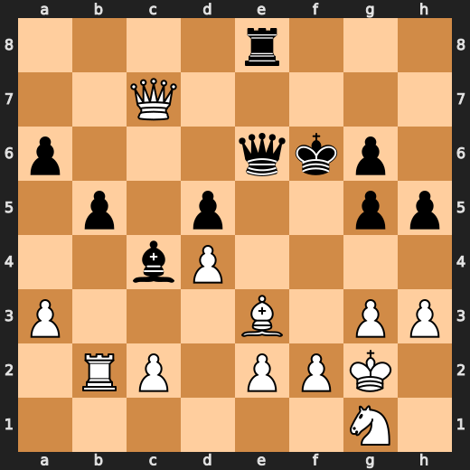
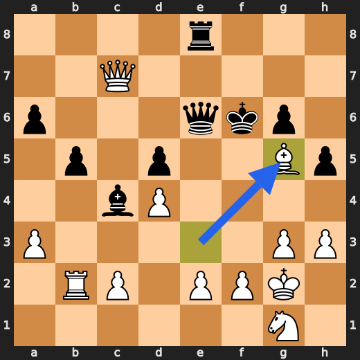
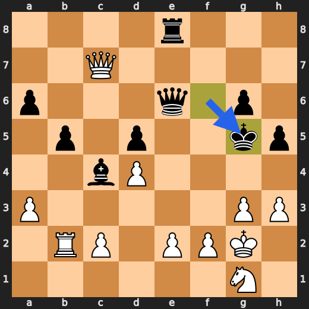
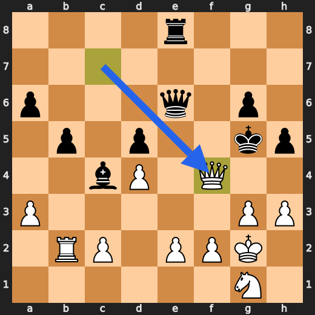

<div align="center">

# ReasonTree

**Give Claude a small search tree before it commits to an answer.**

ReasonTree is a Claude Code skill for multi-step problems: planning, coding, research, writing, and decisions where a one-shot answer is too shallow.

</div>

## What It Does

ReasonTree turns a prompt into a compact state-action tree:

```text
state -> candidate actions -> next states -> scores -> selected path -> synthesis
```

It is not a bigger model and it is not a chess engine. It is a reasoning workflow: make Claude compare a few possible paths, test assumptions, keep the best paths, and explain why the final answer survived.

Default search shape:

- depth: 3 levels
- actions per level: 3
- max depth: 5
- max actions per level: 5

## Install The Skill

Claude Code discovers skills from `.claude/skills/<skill-name>/SKILL.md`.

Personal install, available in every Claude Code project:

```bash
mkdir -p ~/.claude/skills/reasontree
cp .claude/skills/reasontree/SKILL.md ~/.claude/skills/reasontree/SKILL.md
```

Project install, available only in one repo:

```bash
mkdir -p .claude/skills/reasontree
cp /path/to/reason-tree/.claude/skills/reasontree/SKILL.md .claude/skills/reasontree/SKILL.md
```

Then start Claude Code and call:

```text
/reasontree <your task>
```

Example:

```text
/reasontree I need to choose between shipping a small fix today or waiting for a larger refactor next week.
Facts: customer impact is high, rollback is easy, refactor risk is medium.
Goal: choose the lowest-regret next action.
```

## Skill Prompt

The skill lives here:

```text
.claude/skills/reasontree/SKILL.md
```

It is intentionally general. It does not contain chess-specific instructions. Chess is only the visual demo below.

## Python Backend

The real controller is Python:

```text
Python tree controller -> claude -p structured JSON -> score/select paths -> final synthesis
```

Python owns the tree. Claude proposes and scores candidate branches for each expanded node. The controller keeps the strongest paths and expands them up to the configured depth.

Run it after installing the package:

```bash
reasontree \
  --task "Choose the best next step for this product decision..." \
  --model sonnet \
  --effort medium \
  --max-depth 3 \
  --branch-width 3 \
  --keep-paths 2 \
  --trace-log trace.jsonl
```

`--max-budget-usd` is optional. It is not used by default.

## Demo

The demo uses a chess tactic because the answer is easy to verify visually.

```text
FEN: 4r3/2Q5/p3qkp1/1p1p2pp/2bP4/P3B1PP/1RP1PPK1/6N1 w - - 0 1
White to move. Mate in 2.
```

ReasonTree explores the forcing line:

```text
1. Bxg5+ Kxg5 2. Qf4#
```

| Start | Step 1 | Step 2 | Mate |
| --- | --- | --- | --- |
|  |  |  |  |
| position | `1. Bxg5+` | `1... Kxg5` | `2. Qf4#` |

This demo is a workflow illustration, not a benchmark claim about any model.

## Optional Local Demo

```bash
python3 -m venv .venv
.venv/bin/python -m pip install -e .
PYTHONPATH=src .venv/bin/python -m reasontree.cli --html demo/reasontree_demo_report.html
```

## Repo Layout

```text
.claude/skills/reasontree/SKILL.md   the reusable Claude Code skill
assets/chess/                        demo board images
src/reasontree/engine.py             Python ReasonTree controller
src/reasontree/cli.py                small deterministic demo runner
scripts/chess_mate_search.py         optional chess verifier used for local checks
tests/                               regression tests
```

## Status

ReasonTree is an early prototype. The useful claim is narrow:

> Search-time structure can make brittle multi-step reasoning easier to inspect, compare, and verify.
