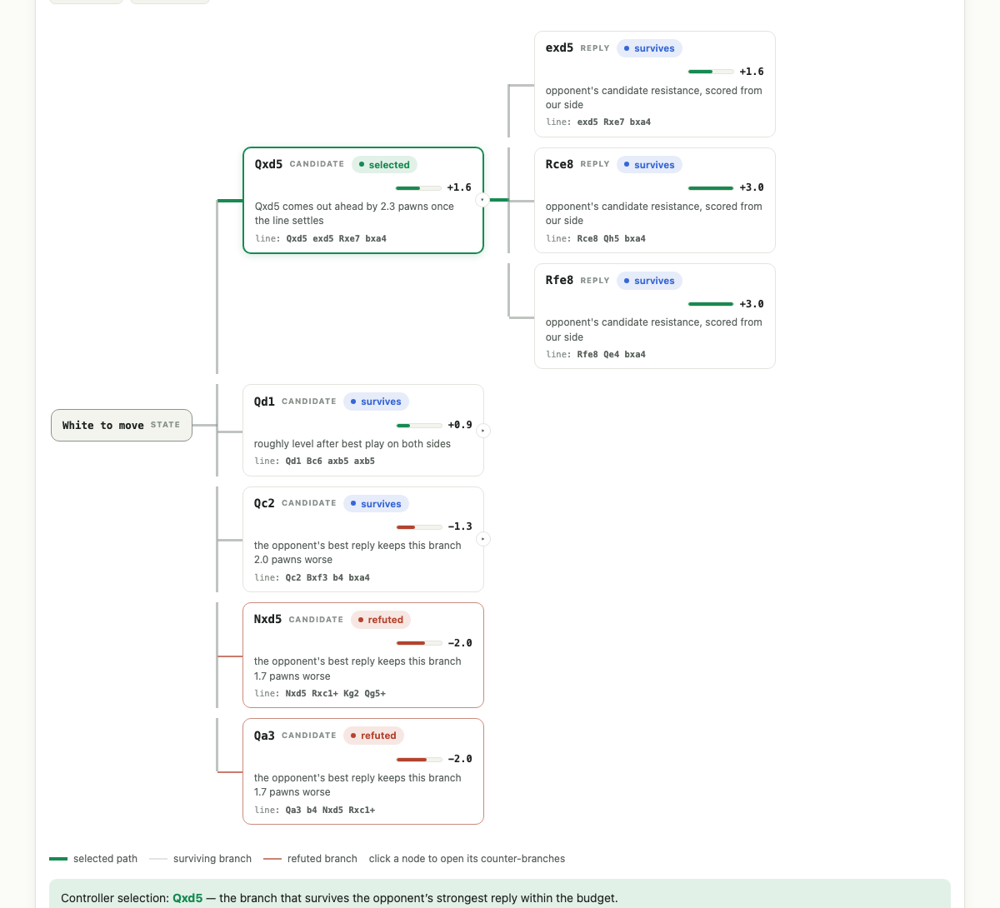

<div align="center">

# ReasonTree

**When a language model thinks out loud, it gets one stream and no undo.
ReasonTree gives it a tree — and lets executed checks, not confidence, have the last word.**

[Two-tier chess benchmark](docs/CHESS_BENCHMARK.md) ·
[The full illustrated tour](docs/examples/why-give-a-model-a-tree.html) ·
[Case study & negative results](docs/CASE_STUDY.md)



*A real search, rendered by the repo's own artifact renderer: every branch inspectable, every score explainable, the selected path in bold.*

</div>

## The story in one paragraph

Ask a fast model a hard question and it answers the way it was built to: one word at a time, in a single unbroken stream. It cannot lay two ideas side by side, cannot put an idea down and come back, and has no scratchpad except its own words — so on problems with precise, changing state, the words drift and the model gets confidently lost. We captured this happening, verbatim: on a rated chess puzzle with **no time or budget limits**, Claude Haiku circled the same candidate three times, misremembered the board, and after 127 seconds committed to a move that was not just wrong but *illegal*. ReasonTree is a small controller built around the fix: turn the problem into a **tree of real, executable states** — candidate actions as branches, an adversary's best reply pushing back on each, scores under a strict compute budget, and a **verifier** (executed code, never another opinion) holding the last word. The same model then explains the branch that survived, in one short call.

## The headline result: same pattern, two model tiers

The claim isn't "our model is smarter." It's that the *same unchanged controller* rescues models at whatever level they fail — measured on frozen, pre-registered Lichess holdouts with the answer key sealed until scoring:

| Tier | Condition | Correct | Median time |
| --- | --- | ---: | ---: |
| Puzzles rated 1809–1819 | raw **Haiku**, no tools, 30s cap | **1/25** | 30.0s |
| | same puzzles, bounded adapter | **21/25** | 5.7s |
| Puzzles rated 2200–2300 | raw **Sonnet 5**, no tools, **240s** cap | **3/25** | 57s |
| | same puzzles, *unchanged* adapter | **18/25** | 3.0s |

At each tier, the first ten "model failed, tree solved" cases were re-run end-to-end with the model as the explanation layer: **10/10 correct both times**, at ~$0.008–0.014 and 5–21 seconds per case — roughly 5× faster and 12× cheaper than the raw attempts they replace. Paired detail worth noting: across both tiers, **raw-only wins: 0**. In separate uncapped probes, raw calls left running for up to 10 minutes still converged mostly to wrong (and once illegal) answers — the failure is miscalibrated confidence, not lack of time. Full protocol, cost tables, and the two honest surprises (deeper search scored *worse* — a textbook horizon effect; and a CPU-contention gotcha that briefly produced wrong results before the serial re-run) are in [the benchmark](docs/CHESS_BENCHMARK.md).

A cross-provider observation, reported as measured: GPT-5.6 Luna shows a different failure profile — a gradual decline with no cliff (3/5 → 1/5 from rating 2000 to 2600, holdout 6/25) — and gets the same kind of uplift from the tree (tree-only 14, raw-only 2). All runs are archived under [`benchmarks/chess/results/`](benchmarks/chess/results/).

## It's not about chess

Chess is just the microscope — the one domain where nobody can argue with the scoreboard. The controller is domain-neutral: an adapter is five functions,

```text
state → candidate actions → executable transition → score / check → stop rule
```

and the repository ships real, captured demonstrations of the same machinery on everyday problems ([full illustrated write-ups](docs/examples/why-give-a-model-a-tree.html), evidence in [`benchmarks/everyday/`](benchmarks/everyday/)):

- **"Two alarms, one email"** — two same-vendor phishing scanners both flag a message; what's the probability it's real? Raw Haiku *noticed* the correlated-evidence trap mid-thought ("I should acknowledge this uncertainty rather than pick an arbitrary number") — then answered **"77%"** anyway. The tree routes the question to a dependence-bounds verifier: the honest answer is **underdetermined, 13.9%–100%**, plus the exact measurement that would settle it. Same trap, everywhere: two medical tests from one lab, two references with one source, two models trained on the same data.
- **"The bug that wasn't where it looked"** — a config leak with a famous decoy (`overrides={}`) standing next to the real culprit (`lru_cache` sharing one mutable dict). The tree treats each suspect as a branch and *executes the code*: symptom reproduced, decoy cleared by observation, fix re-run and watched working — proof instead of plausibility, at half the cost of the raw attempt.
- **"Ship now or wait a week?"** — a judgment call with a hidden collision between two dated facts (a deploy window and a renewal compliance test). No verifier exists for decisions, and the tree doesn't pretend otherwise: advocate branches argue each option, a skeptic pass cross-examines both against every stated fact, and the recommendation ships with its assumptions **labeled**, marked `unverified`. A single stream *may* notice a buried fact; a skeptic pass *must* check.

Adapters we'd write next, same contract: code repair (patches → worktree → tests), scheduling (slots → timezone math → constraint check), SQL/data work (query → execute on sample → invariant check), budget/compliance (allocation → arithmetic → rule check).

## How it differs from Tree of Thoughts, MCTS & friends

Every primitive here has ancestry — branching and scoring (Tree of Thoughts), graph refinement (GoT), adversarial state search (MCTS), self-critique (Reflexion) — and the [tour's comparison section](docs/examples/why-give-a-model-a-tree.html) says so plainly. The deliberate difference is one stubborn design rule:

> **The model never gets the last word on anything a machine can check.**

In ToT-family methods the model grades its own thoughts; research (Huang et al., arXiv 2310.01798) shows self-correction without external feedback fixes wrong answers about as often as it breaks right ones. ReasonTree routes around that ceiling: executable verifiers where the domain allows, honest `unverified` / `underdetermined` labels where it doesn't, and a hard compute budget on every search. We probed the difference directly with a ToT-style propose×3-and-vote harness (our emulation): it went 1/2 on chess rescues at ~$0.20 and ~4 minutes per puzzle, and on the correlated-alerts trap it *named the correct conclusion* ("that argues for a range, not a specific guess") — then answered "15.4%" anyway. **Branches without a verifier are opinions with better formatting.** A full head-to-head against the official ToT/GoT codebases hasn't been run (by us or, to our knowledge, anyone, for the verifier-gated setup) — it's the obvious next experiment and this repo is set up to run it.

## Where it honestly doesn't help

- **Models that already verify:** with tools enabled, one-shot agents wrote their own checkers and nearly saturated AIME — matched-compute tree search added only cost. Published in [the case study](docs/CASE_STUDY.md).
- **Prompt-only trees:** "think in branches" as phrasing, even with all legal moves listed, solved nothing. The structure must be in the machinery.
- **Judgment calls:** the tree sharpens them (branches, skeptic, labeled assumptions) but cannot certify them — and says so.

## Try it

Everything runs on subscription CLIs — no API key required (`claude -p` for Claude Code, `codex exec` for Codex):

```bash
python3 -m venv .venv
.venv/bin/python -m pip install -e .

# the bounded chess adapter, no model call needed
.venv/bin/reasontree-chess-tree \
  --fen '2r2rk1/4q1p1/p3p2p/1p1b4/P7/1QN1RP2/1P3P1P/2R3K1 w - - 0 23' \
  --depth 4 --quiescence-depth 3 --max-nodes 300000 --timeout-s 12

# a deterministic everyday verifier through your subscription model
.venv/bin/reasontree-check --provider claude --model haiku \
  --case-file examples/correlated-alerts.json

# render any search as a navigable HTML artifact (the hero image above)
.venv/bin/reasontree-chess-artifact \
  --fen '2r2rk1/4q1p1/p3p2p/1p1b4/P7/1QN1RP2/1P3P1P/2R3K1 w - - 0 23' \
  --output tree.html
```

Install the skill so `/reasontree <task>` works in Claude Code (or `$reasontree` in Codex):

```bash
mkdir -p ~/.claude/skills && cp -R .claude/skills/reasontree ~/.claude/skills/
mkdir -p ~/.codex/skills  && cp -R .claude/skills/reasontree ~/.codex/skills/
```

The skill prefers an executable adapter, falls back to a direct/counterexample pair with the cheapest real verifier, and labels prompt-only trees `unverified`. Deeper multi-agent workflows (`/reasontree-deep`, `/reasontree-verify` — bounded tournament and adversarial refute-then-repair) live in [`.claude/workflows/`](.claude/workflows/) for the cases where a plausible-but-wrong answer would be expensive.

Any adapter can emit the domain-neutral tree-spec JSON and render it with `reasontree-tree-artifact --spec spec.json --output tree.html` — collapsible branches, verdict-weighted connector lines, and an optional side-by-side pane replaying a captured raw-model stream (see [`docs/examples/rescue-03kkE.html`](docs/examples/rescue-03kkE.html)).

## Reproduce everything

The benchmark source of truth is committed: frozen manifests ([1809–1819](benchmarks/chess/lichess_1800_2000_v1.json), [2200–2300](benchmarks/chess/lichess_2200_2300_v1.json), CC0 Lichess data), machine-readable results, verbatim captured thought streams, and the exact CLI commands in [the benchmark doc](docs/CHESS_BENCHMARK.md). The benchmark harness (`reasontree-chess-eval`) resumes safely and supports direct / matched / prompt-tree / tree / tree-explain conditions across Claude and Codex providers. Every chart page in `docs/examples/` was generated by the repo's own renderer.

```text
src/reasontree/state_search.py       generic bounded state-action search (the core)
src/reasontree/chess_tree.py         chess adapter (deliberately not a full engine)
src/reasontree/verifiers.py          deterministic everyday verifiers
src/reasontree/check_cli.py          subscription-provider verification controller
src/reasontree/chess_benchmark.py    benchmark harness, all conditions
src/reasontree/tree_artifact.py      tree-spec → navigable HTML renderer
src/reasontree/chess_artifact.py     chess → tree-spec producer
benchmarks/                          frozen manifests, results, captured streams
docs/                                benchmark, case study, generated example pages
tests/                               27 regression tests
```

## Status

An early, honestly-scoped prototype. The claim that survives all our controls:

> Externalizing real state transitions, counter-branches, scoring, and stop rules turns a fast model's opaque attempt into a bounded, inspectable, *checkable* workflow. The gain lives in the executable adapter — and where no check can be executed, the output says so instead of borrowing confidence.
