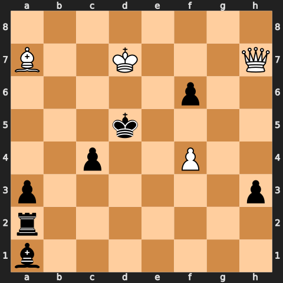
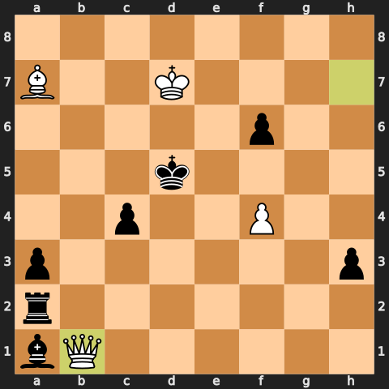
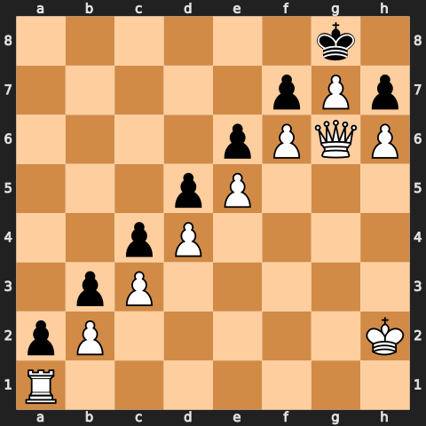
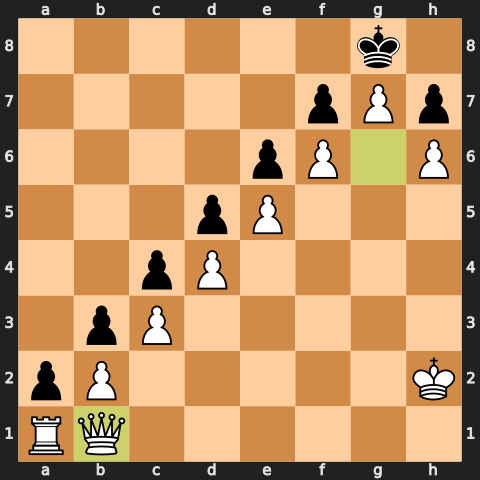

<div align="center">

# ReasonTree

**Give a fast model an executable search tree before it burns inference on an opaque guess.**

ReasonTree is a provider-neutral skill and Python controller for everyday problems where a one-shot answer can hide an unsupported assumption. It runs through Claude Code or Codex CLI using the user's existing subscription login.

</div>

## What It Does

The default path is intentionally small:

```text
task -> state ledger -> bounded branches -> executable transition/check -> one model explanation
```

It is not a bigger model. The core product is a control layer, while chess is one test adapter: separate facts from assumptions, make transitions real when possible, run a check, and let a fast model explain the bounded result.

The failure mode ReasonTree targets is not just "the model got it wrong." It is the messier pattern where a one-shot call thinks for a long time, spends a lot of tokens inside an opaque chain, and still lands on an unsupported answer or no usable answer at all.

ReasonTree treats that as a verification-control problem:

- default to a few branches, not an open-ended agent fleet
- make state transitions executable when the domain allows it
- use deterministic verifier adapters for checkable claims
- reject demanded false precision when the facts do not identify one answer
- call the subscription model once to explain authoritative evidence
- escalate to deeper tournament workflows only when the fast path cannot resolve the task

Current executable/check adapters:

- dependence bounds for repeated tests, alerts, and correlated evidence
- bounded chess state-action search and forced-mate verification

The adapter surface is intended to grow to time zones, units/double-counting checks, code tests, and source-backed fact checks.

## New: Rated Chess Holdout

The current reproducible result uses 25 frozen Lichess holdout puzzles rated 1809-1819:

| Condition | Correct | Median wall time |
| --- | ---: | ---: |
| raw Haiku, no tools, 30s cap | 1/25 | 30.02s |
| bounded ReasonTree chess adapter | 21/25 | 5.70s |

The first ten holdout cases where direct Haiku failed and the bounded tree succeeded were then run through the full tree + Haiku explanation path. It returned 10/10 correct in 8.12-21.47 seconds per case. The complete protocol, all 25 paired outcomes, cost boundaries, and caveats are in [the rated chess benchmark](docs/CHESS_BENCHMARK.md).

In separate long-run telemetry trials, all ten raw prompts still returned no usable move after 102-180 seconds. Six emitted final cost metadata; on those matched cases, tree + Haiku was 9.6x faster, 4.65x cheaper, and used 19.8x fewer model output tokens. The other four raw costs remain unknown.

The important finding is architectural: a prompt saying “think in a tree” was not enough. The gain appeared when ReasonTree externalized legal state transitions, adversarial replies, scoring, and stop rules into executable code. Chess is the microscope; other domains need their own real adapters.

Run the first rescue case locally without a model call:

```bash
.venv/bin/reasontree-chess-tree \
  --fen '2r2rk1/4q1p1/p3p2p/1p1b4/P7/1QN1RP2/1P3P1P/2R3K1 w - - 0 23' \
  --depth 4 --quiescence-depth 3 --max-nodes 300000 --timeout-s 12
```

## Subscription CLI Usage

Claude Code's non-interactive command is `claude -p`. The Codex equivalent is `codex exec`; `codex -p` means profile, not print mode.

```bash
claude -p "your task" --model haiku
codex exec --ephemeral -m gpt-5.6-luna "your task"
```

Both CLIs support account login rather than requiring a manually pasted API key. This repo was tested with Claude Max and Codex signed in through ChatGPT. See the official [Claude Code setup](https://docs.anthropic.com/en/docs/claude-code/getting-started), [Claude CLI reference](https://docs.anthropic.com/en/docs/claude-code/cli-usage), and [Codex with a ChatGPT plan](https://help.openai.com/en/articles/11369540-using-codex-with-chatgpt).

Install the local controller:

```bash
python3 -m venv .venv
.venv/bin/python -m pip install -e .
```

Run the same checked case through either subscription:

```bash
.venv/bin/reasontree-check \
  --provider claude --model haiku \
  --case-file examples/correlated-alerts.json

.venv/bin/reasontree-check \
  --provider codex --model gpt-5.6-luna \
  --case-file examples/correlated-alerts.json
```

## Install The Skill

Claude Code and Codex can install the same skill folder.

Personal install, available in every Claude Code project:

```bash
mkdir -p ~/.claude/skills
cp -R .claude/skills/reasontree ~/.claude/skills/
```

Codex personal install:

```bash
mkdir -p ~/.codex/skills
cp -R .claude/skills/reasontree ~/.codex/skills/
```

Invoke it as `/reasontree <task>` in Claude Code or `$reasontree <task>` in Codex. The skill prefers an executable adapter, falls back to a direct/counterexample pair, and labels prompt-only trees unverified.

Claude example:

```text
/reasontree <your task>
```

Example:

```text
/reasontree I need to choose between shipping a small fix today or waiting for a larger refactor next week.
Facts: customer impact is high, rollback is easy, refactor risk is medium.
Goal: choose the lowest-regret next action.
```

## Optional Deep Workflows

The dynamic Claude workflows use separate ledger, search, verifier, and synthesis agents. They are research/advanced options, not the everyday default:

```bash
mkdir -p .claude/workflows
cp /path/to/reason-tree/.claude/workflows/reasontree-deep.js .claude/workflows/
cp /path/to/reason-tree/.claude/workflows/reasontree-verify.js .claude/workflows/
```

Use the tournament workflow for a bounded, verifier-gated search:

```text
/reasontree-deep <your task>
```

Use the more expensive adversarial variant when a plausible-but-wrong answer would be costly:

```text
/reasontree-verify <your task>
```

`reasontree-verify` adds three independent refutation passes after search. It is not the default for routine work.

## Skill Prompt

The skill lives here:

```text
.claude/skills/reasontree/SKILL.md
```

It is intentionally general. Verification patterns live in `references/verification-patterns.md`; chess is only one deterministic adapter and visual demo.

## Python Backend

The default controller is Python:

```text
Python verifier adapter -> authoritative evidence -> claude -p or codex exec -> concise explanation
```

The controller owns verification and provider invocation. A weak model is not allowed to replace deterministic evidence with a plausible point estimate. The older `reasontree` command remains available for general tree experiments.

General tree experiment:

```bash
reasontree \
  --task "Choose the best next step for this product decision..." \
  --model sonnet \
  --effort medium \
  --max-depth 3 \
  --branch-width 3 \
  --keep-paths 2 \
  --trace-log trace.jsonl
```

`--max-budget-usd` is optional. It is not used by default.

## Everyday Showcase: Correlated Security Alerts

Two phishing scanners each have 90% sensitivity and 5% false-positive rate. Both flag an email whose prior phishing probability is 1%. The scanners share code and training data, but no joint-error measurement is available.

A tempting answer multiplies the scanner likelihoods and reports 76.6%. That number assumes conditional independence, which the facts do not establish. The deterministic dependence adapter proves:

```text
identified exact probability: no
admissible posterior range: 13.9% to 100%
independence scenario: 76.6% (one unproven interior point)
```

On the dated 2026-07-12 subscription run:

| Condition | Result |
| --- | --- |
| Haiku one prompt | returned an unsupported ~15% point estimate and an incorrect 15%-77% range |
| agent-only deep ReasonTree | consumed 33k output tokens and still invented a 20% estimate |
| deterministic `reasontree-check` + Haiku | correct four-line answer in 9.96s with 960 output tokens |
| GPT-5.6 Luna one prompt | already rejected false precision correctly |
| deterministic `reasontree-check` + Luna | same checked answer in 4.86s |

This is the main non-chess story: the improvement comes from moving verification into the controller, not from asking a weak model to reason longer. Full prompts, caveats, and benchmark negatives are in [the case study](docs/CASE_STUDY.md).

## What The Experiments Showed

The original hypothesis was that explicit tree search would produce a general reasoning uplift. Matched-compute tests did not support that claim. Tool-enabled one-shot agents nearly saturated the tested AIME and enumerable logic tasks; on Haiku, the extra structured calls sometimes made results worse.

The narrower result survived:

> ReasonTree is useful when the model guesses instead of checking, or when one opaque attempt burns an unpredictable amount of inference. If the direct agent already verifies its work, the tree may only add cost.

That negative result is part of the project, not something hidden behind the chess demo. See the dated protocols, current Haiku/Sonnet subscription reruns, and benchmark controls in [the case study](docs/CASE_STUDY.md).

## Verifier-Backed Chess Showcase

Chess is the visual microscope because the answer is mechanically checkable. The primary showcase is a Grimshaw interference problem:

```text
FEN: 8/B2K3Q/5p2/3k4/2p2P2/p6p/r7/b7 w - - 0 1
White to move. Mate in 2.
```

The unique first move is the quiet retreat `1.Qb1`. A local `python-chess` search verifies that every one of Black's 14 legal defenses has a mating reply.

| Start | Key move |
| --- | --- |
|  |  |
| White to move | `1.Qb1` |

A second case uses a queen sacrifice to force promotion:

| Start | Key move |
| --- | --- |
|  |  |
| White to move | `1.Qb1 axb1=Q/R/B/N 2.Ra8#` |

On a dated 2026-07-12 subscription run, Haiku one-shot produced no usable Grimshaw answer before a manual 342-second cap after 16.3k output tokens. Haiku `reasontree-deep` returned and verified `Qb1` in 84 seconds with 7.4k output tokens. This is a single operational case, not a model-wide benchmark claim; Sonnet and Haiku also solved other cells directly after invoking their own verifier.

## Optional Local Demo

```bash
python3 -m venv .venv
.venv/bin/python -m pip install -e .
PYTHONPATH=src .venv/bin/python -m reasontree.cli --html demo/reasontree_demo_report.html
```

## Repo Layout

```text
.claude/skills/reasontree/           reusable Claude Code and Codex skill
.claude/workflows/                    optional tournament and adversarial workflows
assets/chess/                        demo board images
benchmarks/chess/                    frozen rated puzzle manifest and results
docs/CASE_STUDY.md                   protocols, positive cases, and negative results
docs/CHESS_BENCHMARK.md              25-case holdout protocol and 10 rescue cases
examples/correlated-alerts.json      reproducible everyday showcase
src/reasontree/check_cli.py          subscription-provider controller
src/reasontree/state_search.py       generic executable state-action contract
src/reasontree/chess_tree.py         bounded chess adapter
src/reasontree/verifiers.py          deterministic verifier adapters
src/reasontree/engine.py             Python ReasonTree controller
src/reasontree/cli.py                small deterministic demo runner
scripts/chess_mate_search.py         optional chess verifier used for local checks
scripts/render_showcase_boards.py    regenerate the showcase SVGs
tests/                               regression tests
```

## Status

ReasonTree is an early prototype. The useful claim is narrow:

> Externalizing real state transitions, counter-branches, scoring, and stop rules can turn a fast model's opaque attempt into a bounded, inspectable workflow. The gain depends on the adapter; prompt-only trees and extra inference are not automatically better.
